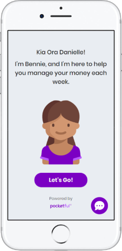
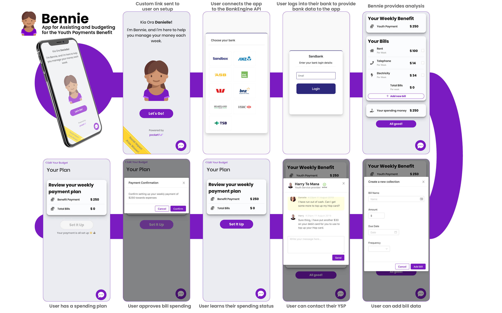

> **Spot prize winner - Most Social Impact**

>This project was created during **New Zealand's first Open Banking Hackathon** weekend organised by [BankEngine](https://bankengine.nz/).

## Bennie - Youth Payment Assistant



### What is Bennie?
Bennie is a money management tool that helps 'NEETs' (15-17 year-old's that are **N**ot **E**mployed, in **E**ducation or **T**raining) on the Youth Payment benefit) manage their recurring bill payments and provide financial education through ‘learning by doing’.

Bennie uses customer transaction data to identify bill payments and income. Bennie analyses the bill data and converts the bill values into weekly payment instalments, which it aggregates into a single weekly bill payment taken to align with weekly benefit income [to prevent spending before bills]. Bennie uses income and bills data to show customers what their ‘disposable income’ is once their bills are taken care of. Consent from the customer to share bank data with bennie aligned with UK Open Banking model.
 

### Why Bennie?
Our vision is to empower and financially educate the most vulnerable people in our society so they can live their best lives. Research shows that ‘NEETs’ on the Youth Payment benefit have difficulty managing their own money.

More women are NEETs than men _(Stats NZ, March 2019)_:
**14.5%** of women aged 15-24 are NEETs
**12.1%** of men aged 15-24 are NEETs. 
Administering the NEET benefit and budgeting assistance is currently seen as an inefficient use of taxpayers’ money.

### How does our product solve the problem?
- Helps NEET peeps pay their bills on time, see the income they have available for other spending (or saving)
- Help them learn to manage their money and empower them 
- Increases efficiency for government

### Screenshots


### Future Product Partnerships

- Billers - bill smoothing arrangement, negotiate a cheaper deal for NEET customers
- Banks - negotiate fairer account terms and conditions with lower/fewer fees for NEET customers 
- Develop distribution network with Youth Service Providers (YSP's)

### Monetisation

- Clip ticket from billers as we help them get their bill payments on time
- Charge outsourcing fees to YSPs for the service

### [Try a demo of the app here](https://laughing-morse-3a00ab.netlify.com/) ###

### The code and how to run it

Download or clone this repo. Use ```npm install``` & ```npm start``` to run the app.
You can use the email address _Danielle@youth.co.nz_ for the authentication screen -  If BankEngine authentication api is no longer working, you can skip it by going to /your-budget route

The app was desinged for the phone screen size, but will work perfectly fine on other screen sizes.

Big thanks to the Team:

- David Ting [@davetingbro](https://github.com/davetingbro)
- Will Cook [@willcook4](https://github.com/willcook4)
- Alex Ivanov [@ivalexig](https://github.com/ivalexig)
- Steve Adams
- Rebecca Fairbrother
